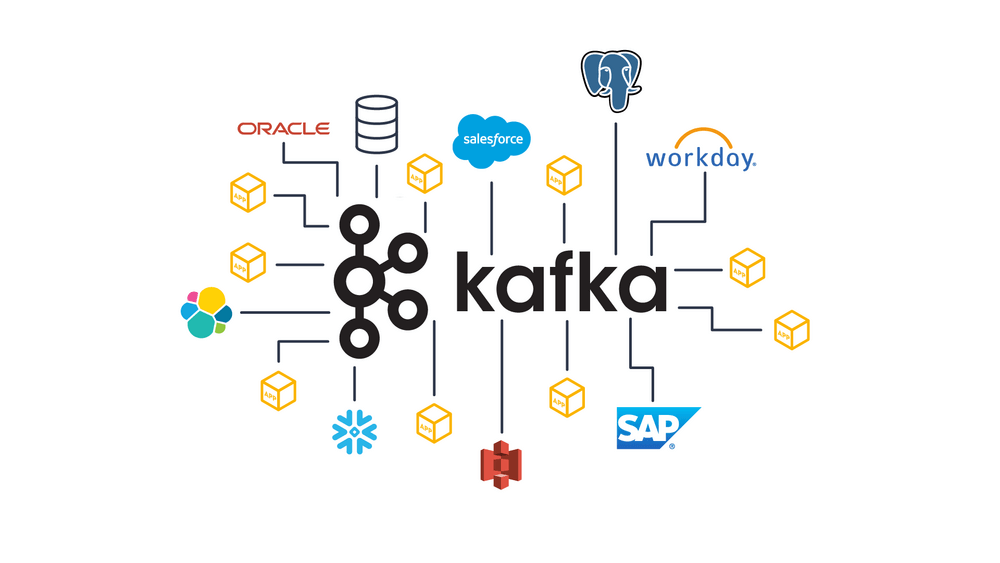

# Kafka Multi Node Cluster Setup with SASL_SSL and SCRAM Authentication with ACL (KRaft Mode)

#### There are 2 types of installation and configure method if you want to deploy with terraform click "Automatic Installation" or click "Manual Installation"

[Automatic Installation](./app/configs/terraform/README.md)

[Manual Installation](./configs/README.md)

## Repository Structure
    .
    ├── app
    │   ├── src
    │   ├── pom.xml
    ├── README.md
    └── configs
        ├── scripts
        │    ├── create-ssl.sh
        │    ├── terraform
             ├── ansible
        ├── client.properties
        ├── server-1.properties
        ├── server-2.properties
        └── server-3.properties