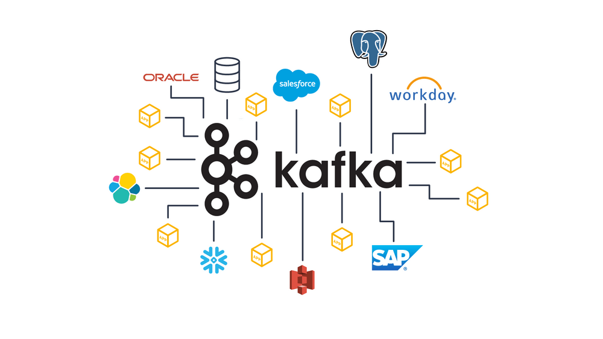

# Kafka Multi Node Cluster Setup with SASL_SSL Authentication and ACL with SCRAM mechanism (KRaft Mode)

#### There are 2 types of installation and configure method if you want to deploy with terraform click "Automatic Installation" or click "Manual Installation"

[Automatic Installation with Ansible](https://github.com/nicat-m/kafka/blob/main/automations/ansible/README.md)

[Automatic Installation with Terraform](./automations/README.md)

[Manual Installation](https://github.com/nicat-m/kafka/blob/main/automations/README.md)

## Repository Structure
    .
    ├── README.md
    └── automations
        ├── README.md    
        ├── ansible
        │      ├── ansible.cfg
        │      ├── inventory
        │      ├── kafka-install.yaml
        │      ├── kafka-configure-plaintext.yaml
        │      ├── kafka-configure-sasl-ssl.yaml
        │      ├── acl-create-user.yaml
        │      ├── templates
        │      │      ├── kafka-server-jaas.conf.j2
        │      │      ├── server.properties.plaintext.j2
        │      │      ├── server.properties.saslssl.j2
        │      │      ├── kafka.service.j2
        │      │      ├── client.properties.j2
        │      │      ├── create-ssl.sh.j2
        │      │      ├── create-acl.sh.j2        
        ├── terraform
        │      ├── main.tf
        │      ├── variables.tf
        │      ├── terraform.tf
        │      ├── output.tf
        │      ├── locals.tf
        │      ├── terraform.tfvars.example
        │      ├── files
        │      │      ├── ansible.tpl
        │      │      ├── env.tpl
        │      │      ├── secret.tpl
        │      │      ├── inventory.tpl

## Resources
#### Kafka download:
* https://kafka.apache.org/downloads
#### Kafka Book
* [Kafka book](./images/Kafka-Definitive-Guide.pdf)
#### Kafka-ui github repo url:
* https://github.com/provectus/kafka-ui/tree/master/documentation/compose
* https://github.com/provectus/kafka-ui/tree/master

## 🚀 About Me
I'm a DevOps Engineer...
