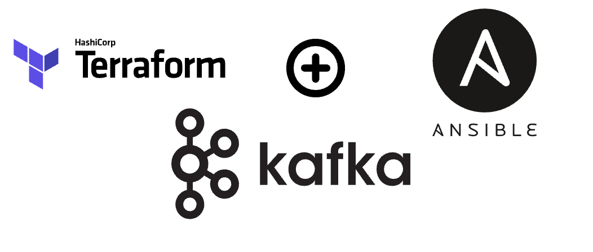

## Automatic Installation with Terraform

### This terraform code provide new virtual machine in VSphere Vcenter and install kafka with sasl or plaintext which you want

### Terraform Structure
            ├── terraform
            │      ├── main.tf
            │      ├── terraform.tfvars
            │      ├── variables.tf
            │      ├── backend.tf
            │      ├── output.tf
            │      ├── files
            │      │      ├── ansible.tpl
            │      │      ├── env.tpl
            │      │      ├── inventory.tpl
            │      │      ├── secret.tpl

### 1. Install terraform and ansible on your management server
```
# Debian

# Install Terraform

sudo apt-get update && sudo apt-get install -y gnupg software-properties-common

wget -O- https://apt.releases.hashicorp.com/gpg | \
gpg --dearmor | \
sudo tee /usr/share/keyrings/hashicorp-archive-keyring.gpg > /dev/null

gpg --no-default-keyring \
--keyring /usr/share/keyrings/hashicorp-archive-keyring.gpg \
--fingerprint

echo "deb [arch=$(dpkg --print-architecture) signed-by=/usr/share/keyrings/hashicorp-archive-keyring.gpg] https://apt.releases.hashicorp.com $(grep -oP '(?<=UBUNTU_CODENAME=).*' /etc/os-release || lsb_release -cs) main" | sudo tee /etc/apt/sources.list.d/hashicorp.list

sudo apt update

sudo apt-get install terraform

# Install Ansible

sudo apt update
sudo apt install software-properties-common
sudo add-apt-repository --yes --update ppa:ansible/ansible
sudo apt install ansible -y

# RHEL

# Install Terraform

sudo yum install -y yum-utils

sudo yum-config-manager --add-repo https://rpm.releases.hashicorp.com/RHEL/hashicorp.repo

sudo yum -y install terraform

# Install Ansible

sudo dnf install ansible -y
```

### 2. Set kafka variables in terraform.tfvars
```
# for variables

vim terraform.tfvars
```

### 3. Let's get start:

```
# Edit backend.tf file which you want to store terraform state file

vim backend.tf

# Initialize and validate configs

terraform init

terraform validate

# Create plan 

terraform plan --out kafka-vms.plan

# NOTICE: Default is Plaintext mode

# if you want to configure with plaintext mode you need to run this command:

terraform apply -var 'action=plaintext'

# if you want to configure with sasl_ssl mode you need to run this command:

terraform apply -var 'action=saslssl'

# if you want to configure with ssl mode you need to run this command:

terraform apply -var 'action=ssl'
```

## Resources
#### Kafka download:
* https://kafka.apache.org/downloads
#### Kafka Book
* [Kafka book](../images/Kafka-Definitive-Guide.pdf)
#### Kafka-ui github repo url:
* https://github.com/provectus/kafka-ui/tree/master/documentation/compose
* https://github.com/provectus/kafka-ui/tree/master