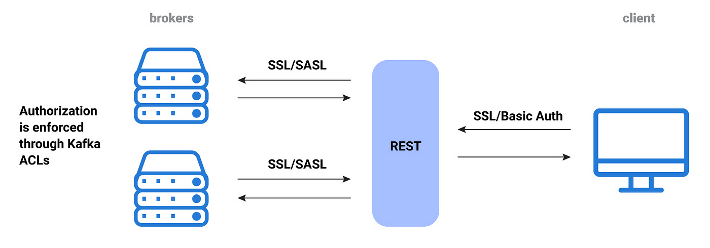
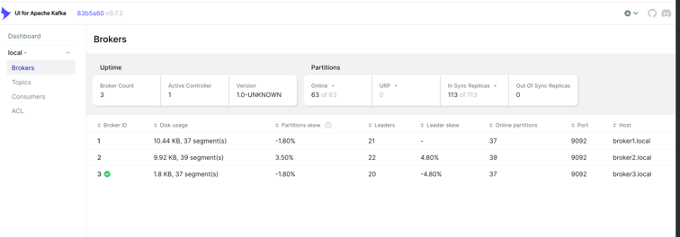
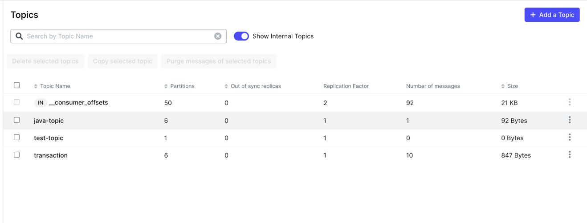
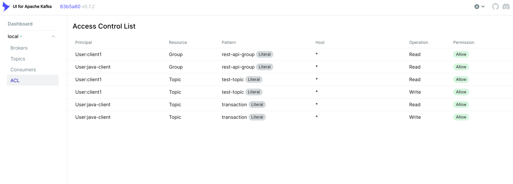

## Manual Installation
### 1. Install kafka and java-jdk each broker nodes

```
wget https://dlcdn.apache.org/kafka/4.0.0/kafka_2.13-4.0.0.tgz
tar -xzvf kafka_2.13-4.0.0
mv kafka_2.13-4.0.0/* /opt/kafka

# Debian
sudo apt install -y openjdk-17-jdk

# RHEL
sudo yum install -y java-17-openjdk-devel
```
First of all we need to run kafka without any security protocol for creating admin user
### 2. Change only this config in "server.properties" file each broker

```
vim /opt/kafka/config/server.properties
```


Find the following lines:
```
...
# The role of this server. Setting this puts us in KRaft mode
process.roles=broker,controller

# The node id associated with this instance's roles
node.id=1

# The connect string for the controller quorum
controller.quorum.bootstrap.servers=broker1.local:9093, broker2.local:9093, broker3.local:9093
...

# Notice: set this domain in your dns or hosts file 
```

```node.id``` specified the node’s ID in the cluster. This is the first node, so it should be left at 1. All nodes must have unique node IDs, so the second and third nodes will have an ID of 2 and 3, respectively.

```controller.quorum.voters``` maps node IDs to their respective addresses and ports for communication. This is where you’ll specify the addresses of all cluster nodes so that each node is aware of all others. Modify the line to look like this:

```
...
# NOTICE: In first node set controller.quorum.voters like this: 

# Do this in first node 
controller.quorum.voters=1@broker1.local:9093

# Do this other nodes 
controller.quorum.voters=1@broker1.local:9093,2@broker2.local:9093,3@broker3.local:9093
...
```

Next, find the following lines in the file:
```
...
listeners=PLAINTEXT://:9092,CONTROLLER://:9093

# Name of listener used for communication between brokers.
inter.broker.listener.name=PLAINTEXT

# Listener name, hostname and port the broker will advertise to clients.
advertised.listeners=PLAINTEXT://broker1.local:9092

num.partitions=6
...
```
As the comment states, this configures each new topic’s default number of partitions. Since you have three nodes, set it to a multiple of two:
A value of 6 here ensures that each node will hold two topic partitions by default.


Next, you’ll configure the replication factor for internal topics, which keeps the consumer offsets and transaction states. Find the following lines:
```
...
offsets.topic.replication.factor=2
transaction.state.log.replication.factor=2
...
```

### 3. Then, generate a new cluster ID and store it an environment variable:
```
# do this only controller node or broker1
 
KAFKA_CLUSTER_ID="$(bin/kafka-storage.sh random-uuid)"

echo $KAFKA_CLUSTER_ID

# Finally, run the following command to generate the log storage:

./bin/kafka-storage.sh format -t $KAFKA_CLUSTER_ID -c config/server.properties

# And write Cluster ID on each broker

KAFKA_CLUSTER_ID="your_cluster_id"

```
### 4. Create system service in all brokers

```
[Unit]
Requires=network.target remote-fs.target
After=network.target remote-fs.target

[Service]
Type=simple
User=root
ExecStart=/bin/sh -c '/opt/kafka/bin/kafka-server-start.sh /opt/kafka/config/server.properties > /opt/kafka/kafka.log 2>&1'
ExecStop=/opt/kafka/bin/kafka-server-stop.sh
Restart=on-abnormal

[Install]
WantedBy=multi-user.target
```
```
sudo systemctl daemon-reload
sudo systemctl enable --now kafka.service
sudo systemctl restart kafka.service
```
Kafka provides the kafka-metadata-quorum.sh script, which shows information about the cluster and its members. Run the following command to execute it:
```
./bin/kafka-metadata-quorum.sh --bootstrap-controller broker1.local:9093 describe --status
```

### 5. Create SCRAM admin user
```
bin/kafka-configs.sh --bootstrap-server broker1.local:9092 \
 --alter --add-config 'SCRAM-SHA-256=[iterations=4096,password=adminpass]' \
 --entity-type users --entity-name admin
```

### 6. Create CA-ROOT, Truststore and Keystore

```
# copy create-ssl.sh to on your server under /opt/kafka/
cd /opt/kafka
chmod u+x create-ssl.sh

./create-ssl.sh

# if script successed then copy keystore and truststore to each broker

cd certs
scp broker2.keystore.jks kafka.truststore.jks user@broker2.local:/opt/kafka/certs/

# do this for another brokers...

```

### 7. Let's get start config with SASL_SSL_SCRAM_SHA256 with ACL

```
# ACL
authorizer.class.name=org.apache.kafka.metadata.authorizer.StandardAuthorizer
allow.everyone.if.no.acl.found=false
super.users=User:admin

# Listeners
inter.broker.listener.name=SASL_SSL
listener.name.controller.scram-sha-256.sasl.jaas.config=org.apache.kafka.common.security.scram.ScramLoginModule required username="admin" password="adminpass";
listeners=SASL_SSL://broker1.local:9092,CONTROLLER://broker1.local:9093 # change this for each broker hostname
listener.security.protocol.map=SASL_SSL:SASL_SSL,CONTROLLER:SASL_SSL
advertised.listeners=SASL_SSL://broker1.local:9092 # change this for each broker 

# SASL & SSL configuration
sasl.enabled.mechanisms=SCRAM-SHA-256
sasl.mechanism.inter.broker.protocol=SCRAM-SHA-256
sasl.mechanism.controller.protocol=SCRAM-SHA-256

ssl.keystore.location=/opt/kafka/certs/broker1.keystore.jks # change this for each broker
ssl.keystore.password=123456
ssl.key.password=123456
ssl.truststore.location=/opt/kafka/certs/kafka.truststore.jks
ssl.truststore.password=123456
ssl.endpoint.identification.algorithm=
```

### 8. Create kafka Java Authentication and Authorization Service (JAAS) config

```
vim /opt/kafka/config/kafka-server-jaas.conf

# copy and paste this config in this file:

KafkaServer {
  org.apache.kafka.common.security.scram.ScramLoginModule required
  username="admin"
  password="adminpass";
};
```
#### Finally, you need to set the environment variable in the Kafka systemd service, as it must be available when Kafka starts and attempts to read the JAAS configuration file.

```
vim /etc/systemd/system/kafka.service

Environment="KAFKA_OPTS=-Djava.security.auth.login.config=/opt/kafka/config/kafka-server-jaas.conf"

sudo systemctl daemon-reload
sudo systemctl restart kafka
```

### 9. Configure client for producer and consumer

#### First we need to create client properties
```
cd /opt/kafka/config

vim client.properties

# Copy and Paste this config for client

ssl.truststore.location=/opt/kafka/certs/kafka.truststore.jks
ssl.truststore.password=123456
security.protocol=SASL_SSL
sasl.mechanism=SCRAM-SHA-256
sasl.jaas.config=org.apache.kafka.common.security.scram.ScramLoginModule required username="admin" password="adminpass";
```

#### Create scram user and give acl for specific topic

```
cd /opt/kafka

bin/kafka-configs.sh --bootstrap-server broker1.local:9092 \
--alter --add-config 'SCRAM-SHA-256=[iterations=4096,password=client123]' \
--entity-type users --entity-name client1 \
--command-config config/client.properties

# Give Write permission to client1 user for produce

bin/kafka-acls.sh --bootstrap-server broker1.local:9092 \
--add --allow-principal User:client1 --operation Write \
--topic test-topic --command-config config/client.properties

# Give Read permission to client1 user for consume

bin/kafka-acls.sh --bootstrap-server broker1.local:9092 \
--add --allow-principal User:client1 --operation Read \
--topic test-topic --command-config config/client.properties

# Give group api permission to client1 user

bin/kafka-acls.sh --bootstrap-server broker1.local:9092 \
--add --allow-principal User:client1 --operation Read \
--group rest-api-group --command-config config/client.properties

```

### 10. Install Kafka UI and verify that everything is working properly !!!

```
# I show with docker-compose

version: '3.4'
services:
  kafka-ui:
    container_name: kafka-ui
    image: provectuslabs/kafka-ui:latest
    extra_hosts:
      - "broker1.local:10.122.65.180"
      - "broker2.local:10.122.65.181"
      - "broker3.local:10.122.65.182"
    ports:
      - 8080:8080
    environment:
      KAFKA_CLUSTERS_0_NAME: local
      KAFKA_CLUSTERS_0_PROPERTIES_SECURITY_PROTOCOL: SASL_SSL
      KAFKA_CLUSTERS_0_BOOTSTRAPSERVERS: broker1.local:9092,broker2.local:9092,broker3.local:9092
      KAFKA_CLUSTERS_0_SSL_TRUSTSTORELOCATION: /kafka.truststore.jks
      KAFKA_CLUSTERS_0_SSL_TRUSTSTOREPASSWORD: "123456"
      KAFKA_CLUSTERS_0_PROPERTIES_SASL_MECHANISM: SCRAM-SHA-256
      KAFKA_CLUSTERS_0_PROPERTIES_SASL_JAAS_CONFIG: 'org.apache.kafka.common.security.scram.ScramLoginModule required username="admin" password="adminpass";'
    volumes:
      - ./kafka.truststore.jks:/kafka.truststore.jks
```

#### Broker Lists


#### Topic Lists


#### ACL Lists



## Resources
#### Kafka download: 
* https://kafka.apache.org/downloads
#### Kafka Book
* [Kafka book](../images/Kafka-Definitive-Guide.pdf)
#### Kafka-ui github repo url:
* https://github.com/provectus/kafka-ui/tree/master/documentation/compose
* https://github.com/provectus/kafka-ui/tree/master


